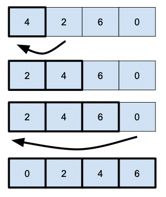
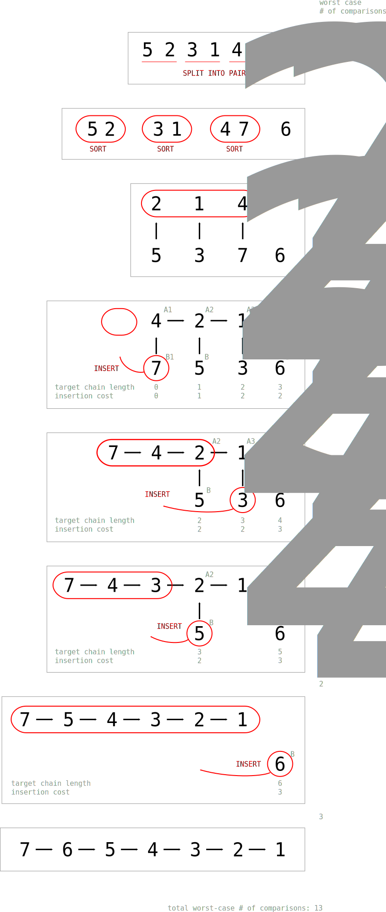

# The `Merge-Insert` sorting algorithm (also known as `Ford-Johnson`)

It feels like `push_swap` was ages ago, doesn't it?

Now we're older, more mature and in possession of a lot more knowledge than then. This must feel like coming home, right? A piece of cake?

Do not be fooled.

Particularly, this has been one of the hardest things to code I've encoutered so far, simply because this algorithm doesn't make much sense at first.

Nor at second, much last at third.

In fact, it's pretty obscure the whole way through, and it only gets clearer (not by much) as the program is drawing to its end.

So, I'm gonna try to explain it to the best of my abilities, in the hopes I can, somehow, answer some of the questions you most definitely will have through it all.

Let's start from the begining.

## What is the `Merge-Insert` algorithm?

It's a Frankstein.

There. I said it.

Most algorithms, specially the most well-known and in wide-use today, often gauge their success on the speed of the sort.

You must have already realized this back in the `push_swap` days, where the success of your program then was closely related to how many (or how little) movements you would make to sort your stacks. And the amount of difficulty you had when you realized basically none of the already-there algorithms could score satifyingly enough. Goodbye, bonus.

Well, the Merge-Insert is one of the algorithms that go the other way. Here, the number of comparisions (or movements, if you will) are much more important than the amount of processing overhead.

It's a very slow algorithm to run. And overall, it's not even that efficient in comparison numbers as some other algorithms out there. However, it does produce the **best worst case scenario** for small range sequeces (47 less, particularly).

So, basically, it's almost never used. So why not loose hours of sleep and peace in order to attempt to code it?

Count me in! _**ironic giggles_

Here's the deal: Merge-Insert has a single, very discreat perk: it's the junction between the **Merge Sort** and the **Insertion Sort** algorithms.

"Why", you ask me? Well, these two algorithms are pretty good - in their own way - in utilizing processing power in order to parallelize tasks and reduce interactions between elements.

**Merge Sort** is a recursive algorithm that continuously splits the array in half until it cannot be further divided, and then proceeds to merge the halves until everything is correctly sorted.

**Insertion sort** is a simple sorting algorithm in which the sequence is virtually split into a sorted and an unsorted part. Values from the unsorted part are picked and placed at the correct position in the sorted part.

Merge-Insert, in its turn, gets the best of both worlds.

It was developed by Lester R. Ford Jr and Selmer M. Johnson in May 1959, and later baptized as the Merge-Insert algorithm by Donald E. Knuth.

Let's talk now about what it does.

## How to implement the Merge-Insert algorithm

### 1. Parse the sequence

It must sound stupid to say so, but there's a reason why I chose to start with this step: the data structure in which you will choose to organize your sequence will play a significant part to the speed of your code.

I know, I know, it's not the aim of this algorithm to be fast, but for academic purposes, we will track how long it takes for the algorithm to complete the task at hand. Better yet: we will compare how long it takes for two different data structure to accomplish the same tasks. 

For this purpose, I chose two: `std:list` and `std:vector` - but only one is "better".

### 2. Catch the 'Straggler'

Start by verifying if the sequence is odd or even numbered. If odd, pop the last element out of it and keep it safe. You will reintroduce it to the sequence soon enough.

### 3. Create pairs

Now, get all the (even) sequence elements and pair them up. You will put each pair in a another list/vector. While you're at it, **sort the pairs** individually by the highest number. Like this:

- Sequence: `[2, 4, 3, 6, 1, 2, 0]`

- Straggler: `0`

- Pairs: `[(4, 2), (3, 6), (2, 1)]`

### 4. Sort the list of pairs by their first element

Just like the title says: consider only the first element of the pair and sort the list. This is where the Merge Sort algorithm comes into play. 

- Sorted Pairs: `[(2, 1), (3, 6), (4, 2)]`

### 5. Create two sequences (one sorted, the other unsorted)

This is the begging of the Insertion Sort part. The first elements of each pair will be the `sorted` list. The second elements will be the `pend` list. You can add the Straggler to the end of `pend`.

- Sorted: `[2, 3, 4]`

- Pend: `[1, 6, 2, 0]`

### 6. Add the first `pend` element to the beggining of the sorted array

You don't have to think about it twice. Since you already sorted each pair, you know the first pair's second element is smaller the the first. Just add it to the beggining and move on to the next step.

### 7. Create the insertion sequence

This, right here, is the catch. The reason why this godforsaken algorithm took me 1 week to complete. Understand this and you'll be good to go.

You can't just add the `pend` elements in order. Why? Because that's not how Ford and Johnson thought about it. For reasons you don't really need to know out-front (there's a whole lot of articles talking about it way better then I ever could, in case you're curious), the best way to insert the unsorted elements into the `sorted` array is to follow some magical numbers sequence called `Jacobsthal`.

The `Jacobsthal sequence` itself goes like this: `[0, 1, 1, 3, 5, 11, 21, 43, 85, 171, 341, 683, 1365, 2731, 5461, 10923, 21845, 43691, 87381, 174763, 349525, ...]`, but a quick look already tells you that using it like this would be impractical; the sequence grows really fast, and it's missing a whole bunch of numbers.

So, what should we do with it? Well, after inserting `pend[0]` out front, you will move to the next jacobsthal number that makes sense: `1`, and insert `pend[1]` into the sorted array in the correct place. Then, instead of moving to the next pend number, you will check the next Jacobsthal number, which is `3`, and see if you have this index on you `pend` list, before inserting the `pend[3]` to the sorted list. Then, before moving to the next Jacobsthal number, you will backtrack to the missing `pend`s, back to front, until you reach a `pend` number that was already inserted, and just then go to the next Jacobsthal number.

Do this forever, and you're good to go.

There is, however, a catch, so pay attention:

Sometimes, the next Jacobsthal number is a number index that pend does not have. For example, in a pend list of 7 elements, the insertion order would be something like this: `[1, 3, 2, 5, 4, 11]` (only 6 elements here 'cause the `pend[0]` was already inserted, remember that). However, there's no index 11 in a list of 7 elements - it only goes to index 6. So the next jacobsthal number must be decreased until it makes sense. The same thing would happen if it was a list of 8 or 9 elements:

- pend.size() == 7 : `[1, 3, 2, 5, 4, 6]`

- pend.size() == 8 : `[1, 3, 2, 5, 4, 7, 6]`

- pend.size() == 9 : `[1, 3, 2, 5, 4, 8, 7, 6]`

- and so on...

### 8. Insert the `pend` elements in the correct position in the `sorted` sequence

Don't forget to use the sequence you found (First `pend[1]`, then `pend[3]`, then `pend[2]`, then `pend[5]` and so on...)

Do it until you're done, and the sorted sequence has the same amount of numbers as the original.

